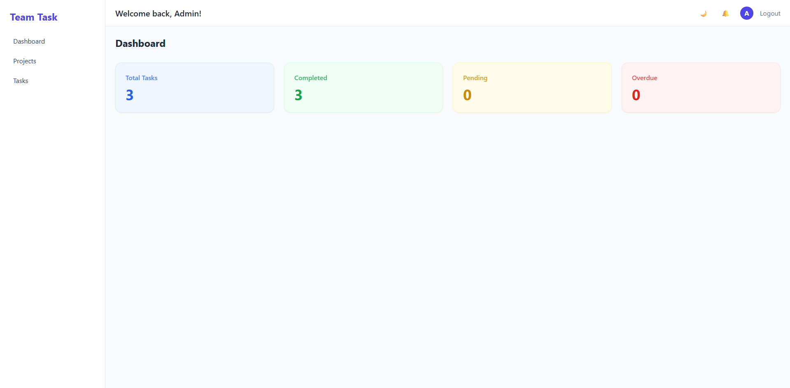
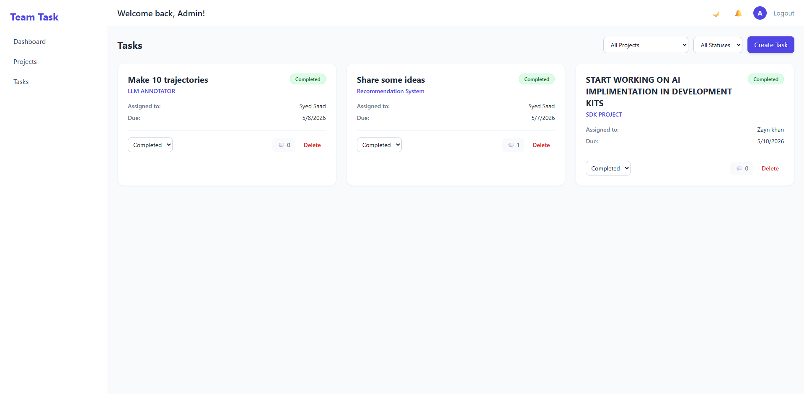
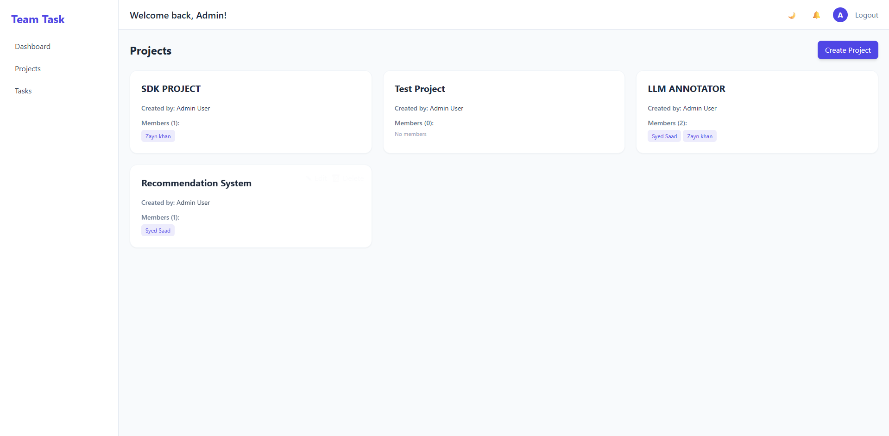
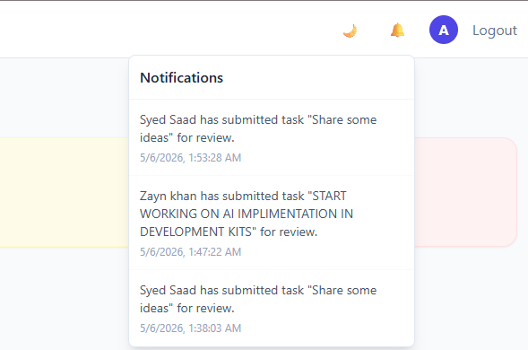

# 🚀 Team Task Manager

A full-stack collaborative task management platform built with the **MERN stack** (MongoDB, Express, React, Node.js). Designed for teams with strict role-based access control, real-time-like notifications, and a clean dark-mode UI.

---

## ✨ Features

### 🔐 Authentication & Security
- JWT-based login and signup
- Role-Based Access Control: **Admin** and **Member** roles
- Strict data isolation — members only see projects and tasks they are assigned to

### 📁 Project Management
- Admins can create, edit, and delete projects
- Multi-select member assignment during project creation/editing
- Cascading deletion — removing a project also removes all its tasks

### ✅ Task Management
- Admins can create, edit, and delete tasks
- Assign tasks to specific members with a due date
- Filter tasks by **Status** and **Project**

### 🔄 Advanced Approval Workflow
| Role | Available Actions |
|------|------------------|
| **Member** | Start Working → Submit for Review |
| **Admin** | ✓ Approve (Completed) or ✗ Request Rework |

**Status lifecycle:** `Pending` → `In Progress` → `In Review` → `Completed` / `Rework`

### 🔔 Real-Time Notifications (In-App Bell)
- **Members** receive notifications when:
  - They are added to a new project
  - A new task is assigned to them
  - Admin changes their task status (Rework / Completed)
- **Admins** receive notifications when:
  - A member submits a task for review
- Notifications can be marked as read individually
- Red pulsing dot badge for unread count

### 💬 Task Comments
- All users can post threaded comments on any task
- Comments display the author's name and timestamp

### 📧 Email Notifications
- Automatic email sent when a task is assigned
- Supports **test mode** (Ethereal Email) and **production mode** (Gmail SMTP)

### 🌙 Dark Mode
- Persistent dark mode toggle via `localStorage`
- Full dark theme across all pages and components

---

## 🛠️ Tech Stack

| Layer | Technology |
|-------|-----------|
| **Frontend** | React (Vite), Tailwind CSS |
| **Backend** | Node.js, Express.js |
| **Database** | MongoDB (Mongoose) |
| **Auth** | JSON Web Tokens (JWT) |
| **Email** | Nodemailer (Ethereal / Gmail) |

---

## 📂 Project Structure

```
Team Task Manager/
├── backend/
│   ├── src/
│   │   ├── controllers/
│   │   │   ├── authController.js
│   │   │   ├── projectController.js
│   │   │   ├── taskController.js
│   │   │   ├── notificationController.js
│   │   │   └── userController.js
│   │   ├── models/
│   │   │   ├── User.js
│   │   │   ├── Task.js
│   │   │   ├── Project.js
│   │   │   └── Notification.js
│   │   ├── routes/
│   │   │   ├── authRoutes.js
│   │   │   ├── projectRoutes.js
│   │   │   ├── taskRoutes.js
│   │   │   ├── notificationRoutes.js
│   │   │   └── userRoutes.js
│   │   ├── middleware/
│   │   │   └── authMiddleware.js
│   │   └── utils/
│   │       └── sendEmail.js
│   ├── server.js
│   ├── package.json
│   └── .env           # ← NOT committed to git
│
└── frontend/
    ├── src/
    │   ├── api/
    │   │   └── axios.js
    │   ├── components/
    │   │   ├── TaskCard.jsx
    │   │   ├── TaskForm.jsx
    │   │   ├── ProjectCard.jsx
    │   │   ├── StatCard.jsx
    │   │   └── StatusBadge.jsx
    │   ├── context/
    │   │   └── AuthContext.jsx
    │   ├── layout/
    │   │   └── MainLayout.jsx
    │   └── pages/
    │       ├── Login.jsx
    │       ├── Signup.jsx
    │       ├── Dashboard.jsx
    │       ├── Projects.jsx
    │       └── Tasks.jsx
    ├── package.json
    └── index.html
```

---

## ⚙️ Getting Started

### Prerequisites
- **Node.js** v18+
- **MongoDB** (local or [MongoDB Atlas](https://www.mongodb.com/atlas))
- **npm**

---

### 1. Clone the Repository

```bash
git clone https://github.com/your-username/team-task-manager.git
cd team-task-manager
```

---

### 2. Backend Setup

```bash
cd backend
npm install
```

Create a `.env` file inside the `backend/` folder:

```env
PORT=5000
MONGO_URI=your_mongodb_connection_string
JWT_SECRET=your_super_secret_jwt_key

# Optional: For real email notifications
# EMAIL_USER=your_gmail@gmail.com
# EMAIL_PASS=your_gmail_app_password
```

> ⚠️ If `EMAIL_USER` and `EMAIL_PASS` are **not** set, the app uses **Ethereal Email** (test mode). Preview URLs will appear in the backend terminal logs.

Start the backend server:

```bash
npm run dev
```

The backend will run at `http://localhost:5000`.

---

### 3. Frontend Setup

```bash
cd ../frontend
npm install
npm run dev
```

The frontend will run at `http://localhost:5173`.

---

## 🔑 Environment Variables

| Variable | Required | Description |
|----------|----------|-------------|
| `PORT` | No | Backend port (default: 5000) |
| `MONGO_URI` | ✅ Yes | MongoDB connection string |
| `JWT_SECRET` | ✅ Yes | Secret key for signing JWTs |
| `EMAIL_USER` | No | Gmail address for sending emails |
| `EMAIL_PASS` | No | Gmail App Password |

---

## 👥 Roles & Permissions

| Feature | Admin | Member |
|---------|-------|--------|
| View all projects & tasks | ✅ | ❌ (own only) |
| Create projects | ✅ | ❌ |
| Edit / Delete projects | ✅ | ❌ |
| Create tasks | ✅ | ❌ |
| Delete tasks | ✅ | ❌ |
| Update task status | ✅ (all statuses) | ✅ (limited) |
| Mark task as Completed | ✅ | ❌ |
| Submit task for Review | ❌ | ✅ |
| View notifications | ✅ | ✅ |
| Add comments | ✅ | ✅ |

---

## 📬 Email Setup (Production)

To send real emails via Gmail:
1. Enable **2-Step Verification** on your Google account.
2. Go to **Google Account → Security → App Passwords**.
3. Create an App Password for "Mail".
4. Add to `backend/.env`:
   ```env
   EMAIL_USER=your_gmail@gmail.com
   EMAIL_PASS=xxxx xxxx xxxx xxxx
   ```
5. Restart the backend server.

---

## 📸 Screenshots

| Dashboard | Tasks |
|----------|------|
|  |  |

| Projects | Notifications |
|----------|--------------|
|  |  |

---

## 🤝 Contributing

Pull requests are welcome! For major changes, please open an issue first to discuss what you would like to change.

---

## 📄 License

This project is open source and available under the [MIT License](LICENSE).

---

## 👤 Author

Built with ❤️ by **Syed Saad Hasan**
